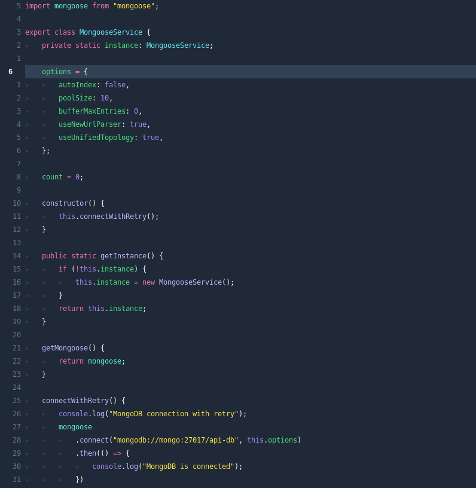
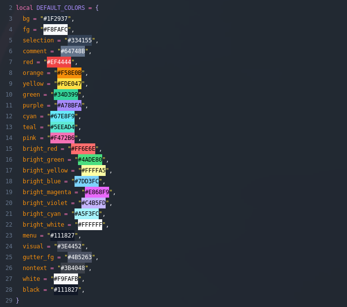

<h1 align="center" >🧛‍♂️ orlock.nvim</h1>

<p align="center"><a href="https://draculatheme.com/">Dracula</a>-ish colorscheme for <a href="https://neovim.io/">NEOVIM</a> written in Lua</p>
<p align="center">Forked from <a href="https://github.com/Mofiqul/dracula.nvim">dracula.nvim</a> to adjust colors to my liking, all credit for all the formatting and support to <a href="https://github.com/Mofiqul">Mofiqul</a>.</p>



## ✔️ Requirements

- Neovim >= 0.5.0
- Treesitter (optional)

## #️ Supported Plugins

- [LSP](https://github.com/neovim/nvim-lspconfig)
- [Treesitter](https://github.com/nvim-treesitter/nvim-treesitter)
- [nvim-compe](https://github.com/hrsh7th/nvim-compe)
- [nvim-cmp](https://github.com/hrsh7th/nvim-cmp)
- [Telescope](https://github.com/nvim-telescope/telescope.nvim)
- [NvimTree](https://github.com/kyazdani42/nvim-tree.lua)
- [BufferLine](https://github.com/akinsho/nvim-bufferline.lua)
- [Git Signs](https://github.com/lewis6991/gitsigns.nvim)
- [Lualine](https://github.com/hoob3rt/lualine.nvim)
- [LSPSaga](https://github.com/glepnir/lspsaga.nvim)
- [indent-blankline](https://github.com/lukas-reineke/indent-blankline.nvim)

## ⬇️ Installation

Install via package manager

```lua
-- Using Packer:
use 'beardage/orlock.nvim'
```

```vim
" Using Vim-Plug:
Plug 'beardage.orlock.nvim'
```

## 🚀 Usage

```lua
-- Lua:
vim.cmd[[colorscheme orlock]]
```

```vim
" Vim-Script:
colorscheme orlock
```

If you are using [`lualine`](https://github.com/hoob3rt/lualine.nvim), you can also enable the provided theme:

> Make sure to set theme as 'orlock'

```lua
require('lualine').setup {
  options = {
    -- ...
    theme = 'orlock'
    -- ...
  }
}'
```

## 🔧 Configuration

If you're using lua

```lua
-- customize orlock color palette
vim.g.orlock_colors = {
  bg = "#1F2937",
  fg = "#F8FAFC",
  selection = "#334155",
  comment = "#64748B",
  red = "#EF4444",
  orange = "#F58E0B",
  yellow = "#FDE047",
  green = "#34D399",
  purple = "#A78BFA",
  cyan = "#67E8F9",
  teal = "#5EEAD4",
  pink = "#F472B6",
  bright_red = "#FF6E6E",
  bright_green = "#4ADE80",
  bright_yellow = "#FFFFA5",
  bright_blue = "#7DD3FC",
  bright_magenta = "#E868F9",
  bright_violet = "#C4B5FD",
  bright_cyan = "#A5F3FC",
  bright_white = "#FFFFFF",
  menu = "#111827",
  visual = "#3E4452",
  gutter_fg = "#4B5263",
  nontext = "#3B4048",
  white = "#F9FAFB",
  black = "#111827",
}
-- show the '~' characters after the end of buffers
vim.g.orlock_show_end_of_buffer = true
-- use transparent background
vim.g.orlock_transparent_bg = true
-- set custom lualine background color
vim.g.orlock_lualine_bg_color = "#44475a"
-- set italic comment
vim.g.orlock_italic_comment = true
```

The same works in viml

```vim
" customize dracula color palette
lua << EOF
vim.g.orlock_colors = {
  bg = "#1F2937",
  fg = "#F8FAFC",
  selection = "#334155",
  comment = "#64748B",
  red = "#EF4444",
  orange = "#F58E0B",
  yellow = "#FDE047",
  green = "#34D399",
  purple = "#A78BFA",
  cyan = "#67E8F9",
  teal = "#5EEAD4",
  pink = "#F472B6",
  bright_red = "#FF6E6E",
  bright_green = "#4ADE80",
  bright_yellow = "#FFFFA5",
  bright_blue = "#7DD3FC",
  bright_magenta = "#E868F9",
  bright_violet = "#C4B5FD",
  bright_cyan = "#A5F3FC",
  bright_white = "#FFFFFF",
  menu = "#111827",
  visual = "#3E4452",
  gutter_fg = "#4B5263",
  nontext = "#3B4048",
  white = "#F9FAFB",
  black = "#111827",
}
EOF
" Enable/disable animations
let bufferline.animation = v:true
" show the '~' characters after the end of buffers
let g:orlock_show_end_of_buffer = 1
" use transparent background
let g:orlock_transparent_bg = 1
" set custom lualine background color
let g:orlock_lualine_bg_color = "#44475a"
-- set italic comment
let g:orlock_italic_comment = 1
```

## 🎨 Importing colors for other usage

```lua
require('orlock').colors()
```

This will return the following table


